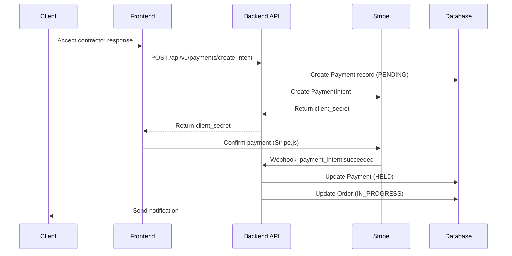
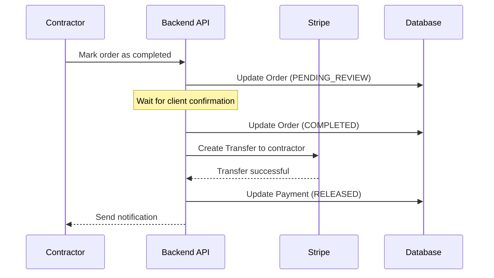
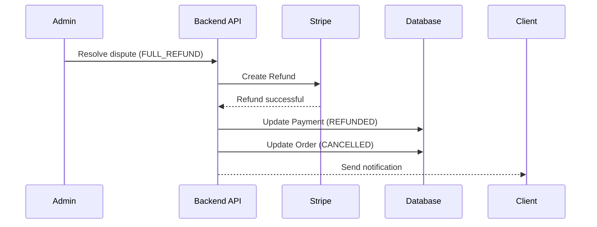

# Payment System - Stripe Integration

> **Version:** 1.0  
> **Last Updated:** November 2, 2025  
> **Integration:** Stripe PaymentIntents + Stripe Connect

---

## 📋 Table of Contents

1. [Overview](#overview)
2. [Architecture](#architecture)
3. [Payment Flows](#payment-flows)
4. [Escrow Mechanism](#escrow-mechanism)
5. [Stripe Connect Setup](#stripe-connect-setup)
6. [API Endpoints](#api-endpoints)
7. [Webhooks](#webhooks)
8. [Security](#security)
9. [Error Handling](#error-handling)
10. [Testing](#testing)

---

## Overview

### Payment Model

Hummii использует **platform model** с escrow mechanism:

1. **Клиент** создаёт заказ и оплачивает через Stripe
2. **Средства замораживаются** (escrow) до завершения заказа
3. **После завершения** средства автоматически переводятся исполнителю
4. **Комиссия платформы** вычитается автоматически

### Key Components

- **Stripe PaymentIntents** - для приёма платежей от клиентов
- **Stripe Connect** - для выплат исполнителям
- **Escrow Logic** - заморозка средств до завершения заказа
- **Automatic Payouts** - автоматические выплаты после завершения

---

## Architecture

### Database Schema

```prisma
model Payment {
  id                String   @id @default(cuid())
  orderId           String   @map("order_id")
  order             Order    @relation(fields: [orderId], references: [id])
  
  clientId          String   @map("client_id")
  client            User     @relation("ClientPayments", fields: [clientId], references: [id])
  
  contractorId      String?  @map("contractor_id")
  contractor        User?    @relation("ContractorPayments", fields: [contractorId], references: [id])
  
  // Stripe IDs
  paymentIntentId   String   @unique @map("payment_intent_id")
  transferId        String?  @unique @map("transfer_id")
  
  // Amounts (in cents)
  amountTotal       Int      @map("amount_total")        // Полная сумма
  amountPlatformFee Int      @map("amount_platform_fee") // Комиссия платформы
  amountContractor  Int      @map("amount_contractor")   // Сумма исполнителю
  
  currency          String   @default("cad")
  
  // Status
  status            PaymentStatus @default(PENDING)
  
  // Metadata
  metadata          Json?
  
  // Timestamps
  paidAt            DateTime? @map("paid_at")
  heldAt            DateTime? @map("held_at")
  releasedAt        DateTime? @map("released_at")
  refundedAt        DateTime? @map("refunded_at")
  
  createdAt         DateTime  @default(now()) @map("created_at")
  updatedAt         DateTime  @updatedAt @map("updated_at")
  
  @@index([orderId])
  @@index([clientId])
  @@index([contractorId])
  @@index([paymentIntentId])
  @@map("payments")
}

enum PaymentStatus {
  PENDING           // Payment intent created, awaiting payment
  PROCESSING        // Payment processing
  HELD              // Funds held in escrow
  RELEASED          // Funds released to contractor
  REFUNDED          // Refunded to client
  FAILED            // Payment failed
  CANCELLED         // Payment cancelled
}

model StripeAccount {
  id                String   @id @default(cuid())
  userId            String   @unique @map("user_id")
  user              User     @relation(fields: [userId], references: [id])
  
  stripeAccountId   String   @unique @map("stripe_account_id")
  
  // Account status
  detailsSubmitted  Boolean  @default(false) @map("details_submitted")
  chargesEnabled    Boolean  @default(false) @map("charges_enabled")
  payoutsEnabled    Boolean  @default(false) @map("payouts_enabled")
  
  // Metadata
  metadata          Json?
  
  createdAt         DateTime  @default(now()) @map("created_at")
  updatedAt         DateTime  @updatedAt @map("updated_at")
  
  @@map("stripe_accounts")
}
```

---

## Payment Flows

### Flow 1: Client Pays for Order



**Steps:**

1. **Client accepts contractor response**
   - Order status: `published` → `awaiting_payment`
   
2. **Create PaymentIntent**
   ```typescript
   const paymentIntent = await stripe.paymentIntents.create({
     amount: orderAmount,
     currency: 'cad',
     customer: clientStripeCustomerId,
     metadata: {
       orderId: order.id,
       clientId: client.id,
       contractorId: contractor.id,
     },
     capture_method: 'automatic',
     transfer_group: `ORDER_${order.id}`, // For Connect transfers
   });
   ```

3. **Frontend confirms payment**
   ```typescript
   const { error } = await stripe.confirmCardPayment(clientSecret, {
     payment_method: {
       card: cardElement,
       billing_details: { name: clientName },
     },
   });
   ```

4. **Webhook: payment_intent.succeeded**
   - Update Payment status: `PENDING` → `HELD`
   - Update Order status: `awaiting_payment` → `in_progress`
   - Send notification to contractor

---

### Flow 2: Release Funds to Contractor



**Steps:**

1. **Contractor marks order as completed**
   - Order status: `in_progress` → `pending_review`

2. **Client confirms completion** (auto-confirm after 72 hours)
   - Order status: `pending_review` → `completed`

3. **Automatic transfer to contractor**
   ```typescript
   const transfer = await stripe.transfers.create({
     amount: amountContractor, // After platform fee
     currency: 'cad',
     destination: contractorStripeAccountId,
     transfer_group: `ORDER_${order.id}`,
     metadata: {
       orderId: order.id,
       paymentId: payment.id,
     },
   });
   ```

4. **Update records**
   - Payment status: `HELD` → `RELEASED`
   - Record `transferId` and `releasedAt`

---

### Flow 3: Refund (Dispute Resolution)



**Refund Types:**

1. **Full Refund** (100% to client)
   ```typescript
   await stripe.refunds.create({
     payment_intent: paymentIntentId,
     reason: 'requested_by_customer',
   });
   ```

2. **Partial Refund** (custom split)
   ```typescript
   // Refund 60% to client
   await stripe.refunds.create({
     payment_intent: paymentIntentId,
     amount: Math.floor(amountTotal * 0.6),
   });
   
   // Transfer 40% to contractor
   await stripe.transfers.create({
     amount: Math.floor(amountTotal * 0.4),
     destination: contractorStripeAccountId,
   });
   ```

---

## Escrow Mechanism

### How It Works

1. **Payment is held** on platform Stripe account
2. **No immediate transfer** to contractor
3. **Funds released** only after order completion
4. **Automatic release** after 72 hours if client doesn't dispute

### Implementation

```typescript
export class EscrowService {
  /**
   * Hold funds in escrow after successful payment
   */
  async holdFunds(paymentId: string): Promise<void> {
    await this.prisma.payment.update({
      where: { id: paymentId },
      data: {
        status: PaymentStatus.HELD,
        heldAt: new Date(),
      },
    });
    
    // Schedule auto-release after 72 hours
    await this.queueService.add('escrow-auto-release', {
      paymentId,
      releaseAt: new Date(Date.now() + 72 * 60 * 60 * 1000),
    }, {
      delay: 72 * 60 * 60 * 1000, // 72 hours
    });
  }

  /**
   * Release funds to contractor
   */
  async releaseFunds(paymentId: string): Promise<void> {
    const payment = await this.prisma.payment.findUnique({
      where: { id: paymentId },
      include: { order: true, contractor: { include: { stripeAccount: true } } },
    });

    if (payment.status !== PaymentStatus.HELD) {
      throw new BadRequestException('Payment not in HELD status');
    }

    // Calculate amounts
    const platformFee = Math.floor(payment.amountTotal * 0.15); // 15% platform fee
    const contractorAmount = payment.amountTotal - platformFee;

    // Create transfer
    const transfer = await this.stripe.transfers.create({
      amount: contractorAmount,
      currency: payment.currency,
      destination: payment.contractor.stripeAccount.stripeAccountId,
      transfer_group: `ORDER_${payment.orderId}`,
      metadata: {
        orderId: payment.orderId,
        paymentId: payment.id,
      },
    });

    // Update payment
    await this.prisma.payment.update({
      where: { id: paymentId },
      data: {
        status: PaymentStatus.RELEASED,
        transferId: transfer.id,
        releasedAt: new Date(),
        amountPlatformFee: platformFee,
        amountContractor: contractorAmount,
      },
    });

    // Create audit log
    await this.auditService.log({
      action: 'PAYMENT_RELEASED',
      userId: payment.contractorId,
      resource: 'payments',
      resourceId: payment.id,
      metadata: { transferId: transfer.id, amount: contractorAmount },
    });
  }

  /**
   * Freeze funds during dispute
   */
  async freezeFunds(paymentId: string): Promise<void> {
    // Funds are already held, just mark dispute
    await this.prisma.payment.update({
      where: { id: paymentId },
      data: {
        metadata: {
          disputeFreeze: true,
          frozenAt: new Date(),
        },
      },
    });
  }
}
```

---

## Stripe Connect Setup

### Why Stripe Connect?

Stripe Connect позволяет платформе:
- Принимать платежи от клиентов
- Выплачивать средства исполнителям
- Взимать комиссию платформы
- Управлять спорами централизованно

### Account Type: Express

**Express accounts** - рекомендуются для marketplace:
- Simplified onboarding
- Stripe-hosted verification
- Limited customization
- Fast setup

### Onboarding Flow

```typescript
export class StripeConnectService {
  /**
   * Create Stripe Connect account for contractor
   */
  async createConnectAccount(userId: string): Promise<string> {
    const user = await this.prisma.user.findUnique({ where: { id: userId } });

    const account = await this.stripe.accounts.create({
      type: 'express',
      country: 'CA',
      email: user.email,
      capabilities: {
        transfers: { requested: true },
      },
      metadata: {
        userId: user.id,
      },
    });

    await this.prisma.stripeAccount.create({
      data: {
        userId: user.id,
        stripeAccountId: account.id,
      },
    });

    return account.id;
  }

  /**
   * Create account link for onboarding
   */
  async createAccountLink(userId: string): Promise<string> {
    const stripeAccount = await this.prisma.stripeAccount.findUnique({
      where: { userId },
    });

    const accountLink = await this.stripe.accountLinks.create({
      account: stripeAccount.stripeAccountId,
      refresh_url: `${process.env.FRONTEND_URL}/dashboard/stripe/refresh`,
      return_url: `${process.env.FRONTEND_URL}/dashboard/stripe/success`,
      type: 'account_onboarding',
    });

    return accountLink.url;
  }

  /**
   * Check if account is ready for payouts
   */
  async isAccountReady(userId: string): Promise<boolean> {
    const stripeAccount = await this.prisma.stripeAccount.findUnique({
      where: { userId },
    });

    const account = await this.stripe.accounts.retrieve(
      stripeAccount.stripeAccountId,
    );

    return account.details_submitted && account.payouts_enabled;
  }
}
```

---

## API Endpoints

### 1. Create Payment Intent

**Endpoint:** `POST /api/v1/payments/create-intent`

**Request:**
```typescript
{
  orderId: string;
  amount: number; // in CAD
}
```

**Response:**
```typescript
{
  clientSecret: string;
  paymentId: string;
}
```

**Logic:**
```typescript
@Post('create-intent')
@UseGuards(JwtAuthGuard)
async createPaymentIntent(
  @User() user: UserEntity,
  @Body() dto: CreatePaymentIntentDto,
) {
  const order = await this.ordersService.findOne(dto.orderId);
  
  // Validate order
  if (order.clientId !== user.id) {
    throw new ForbiddenException('Not your order');
  }
  if (order.status !== OrderStatus.AWAITING_PAYMENT) {
    throw new BadRequestException('Order not awaiting payment');
  }

  // Create payment record
  const payment = await this.paymentsService.create({
    orderId: dto.orderId,
    clientId: user.id,
    contractorId: order.acceptedContractorId,
    amountTotal: dto.amount * 100, // Convert to cents
  });

  // Create Stripe PaymentIntent
  const paymentIntent = await this.stripe.paymentIntents.create({
    amount: dto.amount * 100,
    currency: 'cad',
    customer: user.stripeCustomerId,
    metadata: {
      paymentId: payment.id,
      orderId: order.id,
    },
    transfer_group: `ORDER_${order.id}`,
  });

  // Update payment with Stripe ID
  await this.paymentsService.update(payment.id, {
    paymentIntentId: paymentIntent.id,
  });

  return {
    clientSecret: paymentIntent.client_secret,
    paymentId: payment.id,
  };
}
```

---

### 2. Get Payment Status

**Endpoint:** `GET /api/v1/payments/:id`

**Response:**
```typescript
{
  id: string;
  orderId: string;
  status: PaymentStatus;
  amountTotal: number;
  amountPlatformFee: number;
  amountContractor: number;
  paidAt: string | null;
  releasedAt: string | null;
}
```

---

### 3. Transaction History

**Endpoint:** `GET /api/v1/payments/history`

**Query Params:**
```typescript
{
  page?: number;
  limit?: number;
  status?: PaymentStatus;
}
```

**Response:**
```typescript
{
  data: Payment[];
  total: number;
  page: number;
  limit: number;
}
```

---

### 4. Contractor Balance

**Endpoint:** `GET /api/v1/payments/balance`

**Response:**
```typescript
{
  availableBalance: number; // Available for withdrawal
  pendingBalance: number;   // Held in escrow
  totalEarnings: number;    // All-time earnings
}
```

---

### 5. Withdraw Funds (Future)

**Endpoint:** `POST /api/v1/payments/withdraw`

**Note:** For Phase 1, use Stripe standard payouts (automatic every 2 days).
For Phase 2, implement instant withdrawals with fee.

---

## Webhooks

### Setup

```typescript
@Post('webhook')
async handleWebhook(
  @Req() req: RawBodyRequest<Request>,
  @Headers('stripe-signature') signature: string,
) {
  let event: Stripe.Event;

  try {
    event = this.stripe.webhooks.constructEvent(
      req.rawBody,
      signature,
      process.env.STRIPE_WEBHOOK_SECRET,
    );
  } catch (err) {
    throw new BadRequestException('Invalid signature');
  }

  // Handle event
  await this.webhookHandlerService.handle(event);

  return { received: true };
}
```

### Event Handlers

#### payment_intent.succeeded

```typescript
async handlePaymentIntentSucceeded(event: Stripe.Event): Promise<void> {
  const paymentIntent = event.data.object as Stripe.PaymentIntent;
  const paymentId = paymentIntent.metadata.paymentId;

  await this.escrowService.holdFunds(paymentId);
  
  // Update order status
  const payment = await this.prisma.payment.findUnique({
    where: { id: paymentId },
  });
  await this.ordersService.updateStatus(payment.orderId, OrderStatus.IN_PROGRESS);

  // Send notifications
  await this.notificationsService.send({
    userId: payment.contractorId,
    type: 'ORDER_PAID',
    priority: 'HIGH',
    data: { orderId: payment.orderId },
  });
}
```

#### payment_intent.payment_failed

```typescript
async handlePaymentIntentFailed(event: Stripe.Event): Promise<void> {
  const paymentIntent = event.data.object as Stripe.PaymentIntent;
  const paymentId = paymentIntent.metadata.paymentId;

  await this.prisma.payment.update({
    where: { id: paymentId },
    data: { status: PaymentStatus.FAILED },
  });

  // Notify client
  const payment = await this.prisma.payment.findUnique({
    where: { id: paymentId },
  });
  await this.notificationsService.send({
    userId: payment.clientId,
    type: 'PAYMENT_FAILED',
    priority: 'HIGH',
    data: { orderId: payment.orderId },
  });
}
```

#### account.updated (Connect)

```typescript
async handleAccountUpdated(event: Stripe.Event): Promise<void> {
  const account = event.data.object as Stripe.Account;

  await this.prisma.stripeAccount.updateMany({
    where: { stripeAccountId: account.id },
    data: {
      detailsSubmitted: account.details_submitted,
      chargesEnabled: account.charges_enabled,
      payoutsEnabled: account.payouts_enabled,
    },
  });
}
```

---

## Security

### 1. Never Store Card Data

```typescript
// ❌ NEVER
interface Payment {
  cardNumber: string; // NO!
  cvv: string;        // NO!
}

// ✅ CORRECT
interface Payment {
  paymentIntentId: string;  // Stripe reference
  stripeCustomerId: string; // Stripe reference
}
```

### 2. Webhook Signature Verification

```typescript
// ALWAYS verify signature
event = stripe.webhooks.constructEvent(
  req.rawBody,
  signature,
  process.env.STRIPE_WEBHOOK_SECRET,
);
```

### 3. Idempotency Keys

```typescript
const paymentIntent = await stripe.paymentIntents.create({
  amount: 1000,
  currency: 'cad',
}, {
  idempotencyKey: `order_${orderId}_${timestamp}`,
});
```

### 4. Rate Limiting

```typescript
@Throttle(10, 60) // 10 payments per minute
@Post('create-intent')
```

### 5. Amount Validation

```typescript
// Validate amount matches order
if (dto.amount !== order.agreedPrice) {
  throw new BadRequestException('Amount mismatch');
}

// Validate amount is reasonable
if (dto.amount < 5 || dto.amount > 50000) {
  throw new BadRequestException('Amount out of range');
}
```

---

## Error Handling

### Stripe Errors

```typescript
try {
  const paymentIntent = await stripe.paymentIntents.create({ ... });
} catch (err) {
  if (err.type === 'StripeCardError') {
    throw new BadRequestException('Card declined');
  } else if (err.type === 'StripeInvalidRequestError') {
    throw new BadRequestException('Invalid payment request');
  } else {
    this.logger.error('Stripe error', err);
    throw new InternalServerErrorException('Payment processing error');
  }
}
```

### User-Friendly Messages

```typescript
const ERROR_MESSAGES = {
  card_declined: 'Your card was declined. Please try another card.',
  insufficient_funds: 'Insufficient funds. Please use another payment method.',
  expired_card: 'Your card has expired. Please use another card.',
  incorrect_cvc: 'Incorrect CVC code. Please check and try again.',
};
```

---

## Testing

### Unit Tests

```typescript
describe('PaymentsService', () => {
  it('should create payment intent', async () => {
    const result = await service.createPaymentIntent({
      orderId: 'order_123',
      amount: 100,
    });

    expect(result).toHaveProperty('clientSecret');
    expect(mockStripe.paymentIntents.create).toHaveBeenCalled();
  });

  it('should hold funds after successful payment', async () => {
    await service.holdFunds('payment_123');

    const payment = await prisma.payment.findUnique({
      where: { id: 'payment_123' },
    });

    expect(payment.status).toBe(PaymentStatus.HELD);
  });
});
```

### E2E Tests

```typescript
describe('Payments (e2e)', () => {
  it('should complete full payment flow', async () => {
    // 1. Create payment intent
    const { body } = await request(app.getHttpServer())
      .post('/api/v1/payments/create-intent')
      .send({ orderId: 'order_123', amount: 100 })
      .expect(201);

    // 2. Simulate webhook
    await request(app.getHttpServer())
      .post('/api/v1/payments/webhook')
      .set('stripe-signature', mockSignature)
      .send(mockPaymentSucceededEvent)
      .expect(200);

    // 3. Verify payment status
    const payment = await prisma.payment.findFirst({
      where: { orderId: 'order_123' },
    });

    expect(payment.status).toBe(PaymentStatus.HELD);
  });
});
```

### Manual Testing with Stripe CLI

```bash
# Forward webhooks to local
stripe listen --forward-to localhost:3000/api/v1/payments/webhook

# Trigger test events
stripe trigger payment_intent.succeeded
stripe trigger payment_intent.payment_failed
```

---

## Environment Variables

```bash
# Stripe Keys
STRIPE_SECRET_KEY=sk_test_...
STRIPE_PUBLIC_KEY=pk_test_...
STRIPE_WEBHOOK_SECRET=whsec_...

# Platform Fee
PLATFORM_FEE_PERCENTAGE=15

# Auto-release timeout (hours)
ESCROW_AUTO_RELEASE_HOURS=72

# Payment limits (CAD)
MIN_PAYMENT_AMOUNT=5
MAX_PAYMENT_AMOUNT=50000
```

---

## Next Steps

1. **Phase 1 (Current):**
   - Implement basic payment flow (PaymentIntents)
   - Escrow mechanism
   - Stripe Connect integration

2. **Phase 2 (Future):**
   - Instant withdrawals with fee
   - Multi-currency support
   - Recurring payments for subscriptions

3. **Phase 3 (Advanced):**
   - Split payments (multiple contractors)
   - Partial payments (milestones)
   - Payment scheduling

---

**Last updated:** November 2, 2025  
**Status:** Ready for implementation  
**Priority:** CRITICAL

