# User Flow - Corrected Version

**Version:** 1.0  
**Date:** January 2025  
**Status:** ✅ Based on actual implementation (90% complete)

---

## Table of Contents

1. [Authentication Flow](#1-authentication-flow)
2. [Client Flow](#2-client-flow)
3. [Contractor Flow](#3-contractor-flow)
4. [Order Lifecycle](#4-order-lifecycle)
5. [Chat Flow](#5-chat-flow)
6. [Subscription Flow](#6-subscription-flow)
7. [Dispute Flow](#7-dispute-flow)
8. [Review Flow](#8-review-flow)
9. [Comparison with Design](#9-comparison-with-design)

---

## 1. Authentication Flow

### 1.1 Registration Flow

```mermaid
graph TD
    A[User visits homepage] --> B{Clicks Register}
    B --> C[Select Role: CLIENT or CONTRACTOR]
    C --> D[Fill registration form]
    D --> E[Submit form]
    E --> F[POST /api/v1/auth/register]
    F --> G[Email verification sent]
    G --> H[Redirect to /verify-email-sent]
    H --> I[User checks email]
    I --> J[Click verification link]
    J --> K[GET /api/v1/auth/verify-email]
    K --> L{Verification successful?}
    L -->|Yes| M[Check sessionStorage for redirect]
    L -->|No| N[Show error]
    M --> O{Redirect path exists?}
    O -->|Yes| P[Redirect to saved path]
    O -->|No| Q[Redirect to /login]
    P --> R[User authenticated ✅]
    Q --> R
```

**Steps:**

1. **User clicks "Register"** on homepage
   - Route: `/register`
   - Role selection: CLIENT or CONTRACTOR

2. **Fill registration form**
   - Email, password (min 12 chars, uppercase, lowercase, number, special char)
   - Name, phone (optional)
   - Role selection (CLIENT or CONTRACTOR)

3. **Submit form**
   - POST `/api/v1/auth/register`
   - Email verification token generated
   - Verification email sent via OneSignal

4. **Email verification**
   - User redirected to `/verify-email-sent`
   - User clicks link in email
   - GET `/api/v1/auth/verify-email?token=xxx`
   - Email verified ✅

5. **Redirect after verification**
   - Check `sessionStorage.getItem('redirect_after_auth')`
   - If exists: redirect to saved path (e.g., `/orders/create`)
   - If not: redirect to `/login`
   - Clear sessionStorage

### 1.2 Login Flow

```mermaid
graph TD
    A[User clicks Login] --> B[Route: /login]
    B --> C{Login method}
    C -->|Email/Password| D[Fill login form]
    C -->|OAuth| E[Google/Apple OAuth]
    D --> F[POST /api/v1/auth/login]
    E --> G[OAuth callback]
    G --> F
    F --> H{Login successful?}
    H -->|Yes| I[Set HTTP-only cookies]
    I --> J[Check sessionStorage for redirect]
    J --> K{Redirect path exists?}
    K -->|Yes| L[Redirect to saved path]
    K -->|No| M[Redirect to dashboard]
    H -->|No| N[Show error message]
    L --> O[User authenticated ✅]
    M --> O
```

**Steps:**

1. **User clicks "Login"**
   - Route: `/login`
   - Options: Email/Password or OAuth (Google/Apple)

2. **Email/Password login**
   - Fill email and password
   - POST `/api/v1/auth/login`
   - JWT tokens set in HTTP-only cookies (accessToken: 15min, refreshToken: 7days)

3. **OAuth login**
   - Click "Login with Google" or "Login with Apple"
   - Redirect to OAuth provider
   - OAuth callback: `/auth/callback`
   - Create/update user account
   - Set HTTP-only cookies

4. **Redirect after login**
   - Check `sessionStorage.getItem('redirect_after_auth')`
   - If exists: redirect to saved path
   - If not: redirect to role-based dashboard:
     - CLIENT → `/orders/my-orders`
     - CONTRACTOR → `/contractor/dashboard`
     - ADMIN → `/admin`

### 1.3 Protected Actions Flow

```mermaid
graph TD
    A[User clicks protected action] --> B[useProtectedAction hook]
    B --> C{Is authenticated?}
    C -->|No| D[Show AuthModal]
    C -->|Yes| E{Has required role?}
    D --> F[Save current URL to sessionStorage]
    F --> G[Redirect to /register or /login]
    E -->|No| H[Show error: Insufficient role]
    E -->|Yes| I[Execute callback]
    I --> J[Action performed ✅]
```

**Example: Creating an order (requires CLIENT role)**

1. User clicks "Create Order" button
2. `useProtectedAction` hook checks:
   - `isAuthenticated` → false? Show AuthModal
   - `hasRole(['CLIENT'])` → false? Show error
3. If not authenticated:
   - Show AuthModal with reason: "To create an order"
   - Save current URL to `sessionStorage.setItem('redirect_after_auth', '/orders/create')`
   - Redirect to `/register` or `/login`
4. After successful auth:
   - Read redirect path from sessionStorage
   - Redirect to saved path
   - Execute action

---

## 2. Client Flow

### 2.1 Variant A: Direct Order to Contractor

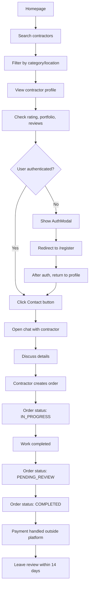

**Steps:**

1. **Homepage → Search contractors**
   - Search by category, name, location
   - Filter by rating, verification, online status
   - Map view with nearby contractors

2. **View contractor profile**
   - Route: `/contractors/:id` or `/performer/:slug`
   - View: Rating, portfolio (max 10 items), reviews, categories, experience
   - Badges: Verified, Top Pro, New

3. **Contact contractor**
   - Click "Contact" button
   - Requires authentication (useProtectedAction)
   - Opens chat with contractor
   - Chat created automatically

4. **Discuss details**
   - Real-time chat via WebSocket
   - Content moderation: phones, emails, URLs blocked
   - Typing indicators, read receipts

5. **Contractor creates order**
   - Contractor accepts request
   - Order created with status: IN_PROGRESS
   - Client and contractor notified

6. **Work completion**
   - Order status: PENDING_REVIEW
   - Client marks as completed
   - Order status: COMPLETED

7. **Payment & Review**
   - Payment handled outside platform (MVP scope)
   - Client can leave review within 14 days
   - Review includes 4 criteria: Quality, Professionalism, Communication, Value

### 2.2 Variant B: Public Order (Get Proposals)

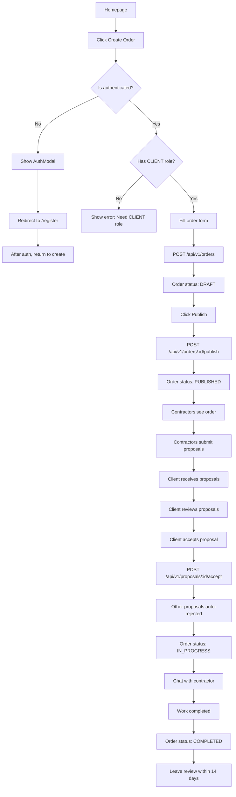

**Steps:**

1. **Create order**
   - Click "Create Order" (requires CLIENT role)
   - Fill form: Title, description, category, budget, deadline, location, photos
   - Submit: POST `/api/v1/orders`
   - Order created with status: DRAFT

2. **Publish order**
   - Review draft order
   - Click "Publish"
   - POST `/api/v1/orders/:id/publish`
   - Order status: PUBLISHED
   - Order visible to contractors

3. **Receive proposals**
   - Contractors see published orders
   - Contractors submit proposals (price, timeline, description)
   - Client receives notifications
   - View proposals: GET `/api/v1/orders/:id/proposals`

4. **Accept proposal**
   - Review proposals
   - Select best proposal
   - POST `/api/v1/proposals/:id/accept`
   - Other proposals auto-rejected
   - Order status: IN_PROGRESS
   - Chat created automatically

5. **Work completion**
   - Order status: PENDING_REVIEW → COMPLETED
   - Payment handled outside platform
   - Leave review within 14 days

---

## 3. Contractor Flow

### 3.1 Registration & Profile Setup

```mermaid
graph TD
    A[Register as CONTRACTOR] --> B[Fill basic profile]
    B --> C[Create contractor profile]
    C --> D[POST /api/v1/contractors/me]
    D --> E[Add categories max 5]
    E --> F[Add portfolio items max 10]
    F --> G[Set location lat/lon]
    G --> H[Set hourly rate]
    H --> I[Add business name]
    I --> J[Profile complete ✅]
    J --> K{Subscribe to tier?}
    K -->|Yes| L[Choose subscription tier]
    K -->|No| M[Stay on FREE tier]
    L --> N[POST /api/v1/subscriptions]
    N --> O[Stripe Customer Portal]
    O --> P[Subscription active]
    M --> Q[Search orders]
    P --> Q
```

**Steps:**

1. **Registration**
   - Register with role: CONTRACTOR
   - Email verification required

2. **Create contractor profile**
   - POST `/api/v1/contractors/me`
   - Fields: Bio, experience (years), hourly rate, business name
   - Location: Set lat/lon (Haversine formula for radius search)

3. **Add categories**
   - POST `/api/v1/contractors/me/categories`
   - Max 5 categories (depends on subscription tier)
   - FREE tier: max 3 categories
   - STANDARD/PROFESSIONAL/ADVANCED: max 5 categories

4. **Add portfolio**
   - POST `/api/v1/contractors/me/portfolio`
   - Max 10 portfolio items
   - Upload photos via Cloudflare R2
   - Add title, description

5. **Optional: Verification**
   - POST `/api/v1/verification/create`
   - Stripe Identity verification (Canadian documents)
   - Documents: Driver's License, Passport, Provincial ID
   - Verified badge on profile

6. **Optional: Subscription**
   - Choose tier: FREE, STANDARD, PROFESSIONAL, ADVANCED
   - POST `/api/v1/subscriptions`
   - Stripe Customer Portal for payment management
   - Subscription active → unlock features

### 3.2 Finding & Applying to Orders

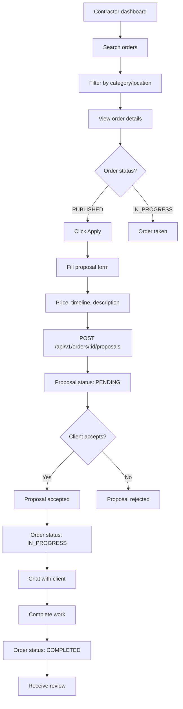

**Steps:**

1. **Search orders**
   - GET `/api/v1/orders/search`
   - Filter by category, location, budget, date
   - View order details

2. **Submit proposal**
   - Click "Apply" on order
   - Fill proposal form: Price, timeline, description
   - POST `/api/v1/orders/:orderId/proposals`
   - Proposal status: PENDING
   - Rate limit: 20 proposals/hour

3. **Proposal accepted**
   - Client accepts proposal
   - Other proposals auto-rejected
   - Order status: IN_PROGRESS
   - Chat created automatically
   - Notification sent

4. **Work completion**
   - Complete work
   - Client marks order as completed
   - Order status: COMPLETED
   - Receive review from client

---

## 4. Order Lifecycle

### Status Flow Diagram

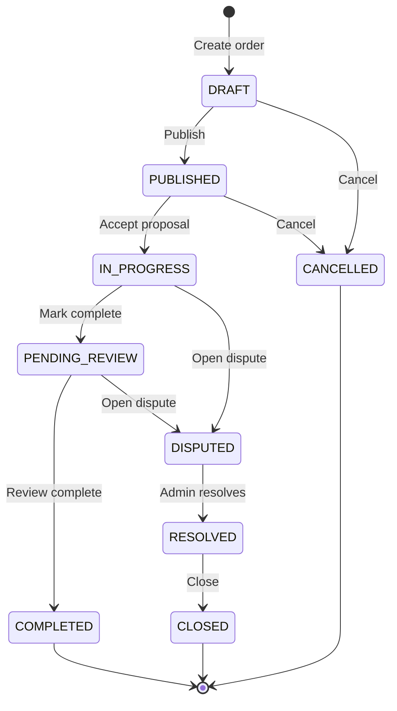

**Status Definitions:**

- **DRAFT**: Order created but not published
  - Can be edited or deleted by client
  - Not visible to contractors

- **PUBLISHED**: Order published and visible to contractors
  - Contractors can submit proposals
  - Client can cancel

- **IN_PROGRESS**: Proposal accepted, work in progress
  - Chat active
  - Can be disputed or cancelled

- **PENDING_REVIEW**: Work completed, awaiting review
  - Client can mark as completed
  - Can be disputed

- **COMPLETED**: Order completed successfully
  - Reviews can be left (14 days deadline)
  - Payment handled outside platform

- **CANCELLED**: Order cancelled
  - Can be cancelled from DRAFT or PUBLISHED
  - No reviews possible

- **DISPUTED**: Dispute opened
  - Admin review required
  - Order frozen until resolution

**Status Transitions:**

- Only valid transitions allowed (FSM pattern)
- Admin can override transitions (e.g., DISPUTED → COMPLETED)

---

## 5. Chat Flow

### 5.1 Chat Creation & Messaging

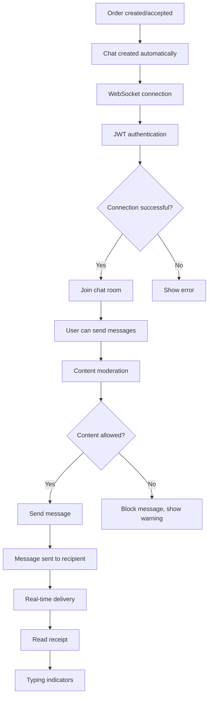

**Features:**

1. **Automatic chat creation**
   - Created when proposal accepted
   - Created when direct order initiated
   - One chat per order

2. **WebSocket connection**
   - Socket.io for real-time messaging
   - JWT authentication required
   - Connection to `/chat/:orderId` room

3. **Message sending**
   - Max 2000 characters per message
   - Text only (no files/media in MVP)
   - Rate limit: 20 messages/minute

4. **Content moderation**
   - Automatic blocking of:
     - Phone numbers (Canadian format)
     - Email addresses
     - URLs (except platform URLs)
     - Social media handles (@instagram, @telegram, @whatsapp)
     - Profanity (English + French)
   - Blocked content replaced with `***`
   - User notified

5. **Message editing**
   - Edit within 5 minutes of sending
   - PATCH `/api/v1/chat/:orderId/messages/:id`
   - Marked as "edited" in UI

6. **Read receipts & typing indicators**
   - Real-time read status
   - Typing indicators
   - Online/offline status

### 5.2 Chat History & Export

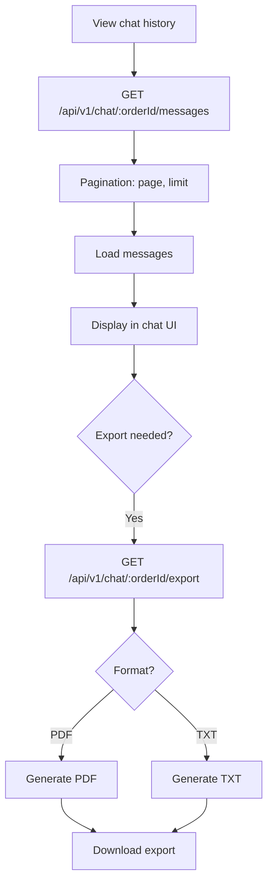

**Chat Retention:**

- History stored: 90 days (PIPEDA compliance)
- Auto-cleanup: Daily cron job (02:00 UTC)
- Export available: PDF or TXT format
- Export includes: All messages, timestamps, participants

---

## 6. Subscription Flow

### 6.1 Subscription Management

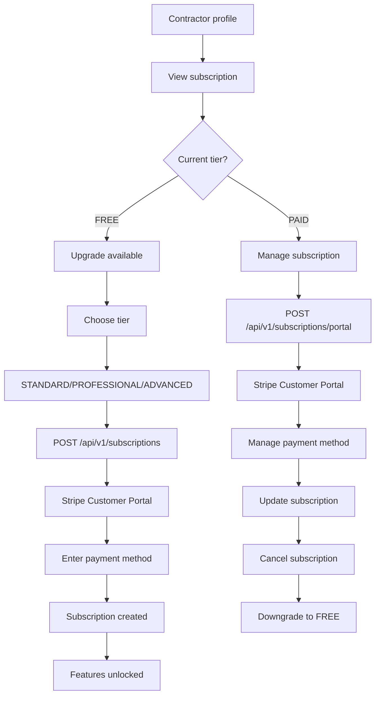

**Subscription Tiers:**

| Tier | Price | Max Categories | Partner Discount | Features |
|------|-------|---------------|-----------------|----------|
| **FREE** | $0 | 3 | 0% | Basic features |
| **STANDARD** | $X/month | 5 | 5% | Standard features |
| **PROFESSIONAL** | $Y/month | Unlimited | 10% | Priority listing |
| **ADVANCED** | $Z/month | Unlimited | 15% | Featured profile, no platform fee |

**Features:**

1. **Create subscription**
   - POST `/api/v1/subscriptions`
   - Requires CONTRACTOR role
   - Stripe Customer ID created
   - Stripe Subscription created

2. **Manage subscription**
   - POST `/api/v1/subscriptions/portal`
   - Redirect to Stripe Customer Portal
   - Manage payment methods
   - View invoices/receipts
   - Update or cancel subscription

3. **Upgrade/Downgrade**
   - Upgrade: Immediate feature access
   - Downgrade: Grace period until period end
   - Prorated billing

4. **Webhook events**
   - `customer.subscription.created` → Activate subscription
   - `customer.subscription.updated` → Update tier
   - `customer.subscription.deleted` → Downgrade to FREE
   - `invoice.payment_succeeded` → Extend subscription
   - `invoice.payment_failed` → Notify user

5. **Feature gating**
   - Category limits enforced by tier
   - Subscription guard checks tier
   - Returns 402 Payment Required if tier insufficient

---

## 7. Dispute Flow

### 7.1 Opening a Dispute

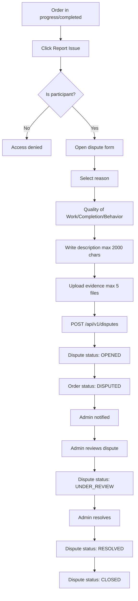

**Steps:**

1. **Open dispute**
   - Only participants can open dispute
   - POST `/api/v1/disputes`
   - Reasons: Quality of Work, Work Not Completed, Unprofessional Behavior
   - Description: max 2000 characters
   - Rate limit: 5 disputes/day

2. **Upload evidence**
   - POST `/api/v1/disputes/:id/evidence`
   - Max 5 files per dispute
   - Max 5MB per file
   - Types: Images, screenshots, documents
   - Uploaded to Cloudflare R2 (private bucket)

3. **Dispute status flow**
   - OPENED → UNDER_REVIEW → AWAITING_INFO → RESOLVED → CLOSED
   - Admin can update status
   - Status transitions validated (FSM pattern)

4. **Admin resolution**
   - Admin reviews evidence
   - Admin makes decision:
     - BLOCK_USER: Block user account
     - SUSPEND_ACCOUNT: Suspend account temporarily
     - CLOSE_ORDER: Close order
     - WARN_USER: Warning message
     - NO_ACTION: No action needed
   - SLA: 3-5 business days

5. **Dispute messages**
   - Participants can add messages
   - Admin can add internal messages (not visible to users)
   - Rate limit: 20 messages/hour

---

## 8. Review Flow

### 8.1 Leaving a Review

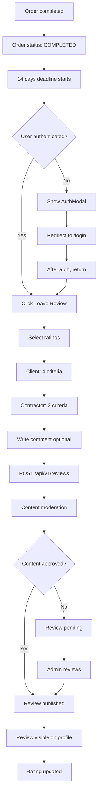

**Review Criteria:**

**Client rates Contractor (4 criteria):**
- Quality of Work (1-5★)
- Professionalism (1-5★)
- Communication (1-5★)
- Value for Money (1-5★)

**Contractor rates Client (3 criteria):**
- Communication (1-5★)
- Professionalism (1-5★)
- Payment (1-5★)

**Rules:**

1. **Review deadline**
   - 14 days after order completion
   - Calculated from `order.completedAt`
   - After deadline: Review option disabled

2. **Review submission**
   - POST `/api/v1/reviews`
   - Rating is required (all criteria)
   - Comment is optional
   - Rate limit: 5 reviews/hour

3. **Content moderation**
   - Automatic moderation via ContentModerationService
   - Blocks: phones, emails, URLs, social media, profanity
   - If flagged: Review status: PENDING
   - Admin reviews pending reviews

4. **Simultaneous review**
   - Both parties can review simultaneously
   - Reviews hidden until both submitted or deadline passes
   - "Blind review" system

5. **Review response**
   - Reviewee can respond to review
   - POST `/api/v1/reviews/:id/response`
   - One response per review

6. **Rating calculation**
   - Weighted formula: 70% rating + 20% experience + 10% verification
   - Minimum rating for visibility: 3.0★
   - Below 3.0★: Profile hidden from search

7. **Review editing**
   - Can edit before moderation approval
   - Cannot edit after published
   - PATCH `/api/v1/reviews/:id`

8. **Review deletion**
   - Soft delete: Sets `isVisible` to false
   - DELETE `/api/v1/reviews/:id`
   - Only owner can delete

---

## 9. Comparison with Design

### 9.1 Potential Issues in Original Design

Based on the analysis of the implementation, here are potential discrepancies between the original design flow and the actual implementation:

#### Missing Flows

1. **Email Verification Flow**
   - ❌ Design may not show email verification step
   - ✅ Implementation: Email verification required after registration
   - 🔧 **Fix:** Add verification step in design

2. **Redirect After Auth**
   - ❌ Design may not show sessionStorage redirect logic
   - ✅ Implementation: URL saved in sessionStorage, redirect after auth
   - 🔧 **Fix:** Add redirect flow in design

3. **Protected Actions Modal**
   - ❌ Design may not show AuthModal for protected actions
   - ✅ Implementation: useProtectedAction hook shows AuthModal
   - 🔧 **Fix:** Add AuthModal flow in design

4. **Subscription Tier Limits**
   - ❌ Design may not show subscription tier restrictions
   - ✅ Implementation: Category limits depend on subscription tier
   - 🔧 **Fix:** Add subscription tier limits in contractor flow

5. **PIPEDA Compliance Flows**
   - ❌ Design may not show data export/account deletion
   - ✅ Implementation: GET `/api/v1/users/me/export`, DELETE `/api/v1/users/me`
   - 🔧 **Fix:** Add PIPEDA compliance flows in design

#### Incorrect Order Statuses

1. **Order Lifecycle**
   - ❌ Design may show old statuses (PENDING, ACCEPTED, PAID)
   - ✅ Implementation: DRAFT, PUBLISHED, IN_PROGRESS, PENDING_REVIEW, COMPLETED, CANCELLED, DISPUTED
   - 🔧 **Fix:** Update order statuses in design

2. **Status Transitions**
   - ❌ Design may allow invalid transitions
   - ✅ Implementation: FSM pattern with validated transitions
   - 🔧 **Fix:** Update status transition rules in design

#### Missing Features

1. **Chat Moderation**
   - ❌ Design may not show automatic content moderation
   - ✅ Implementation: Automatic blocking of phones, emails, URLs, social media, profanity
   - 🔧 **Fix:** Add moderation flow in chat design

2. **Dispute Resolution**
   - ❌ Design may not show dispute flow
   - ✅ Implementation: Full dispute system with evidence upload, admin resolution
   - 🔧 **Fix:** Add dispute flow in design

3. **Subscription Management**
   - ❌ Design may not show Stripe Customer Portal
   - ✅ Implementation: Subscription management via Stripe Customer Portal (hosted solution)
   - 🔧 **Fix:** Add Stripe Portal flow in design

4. **Review Moderation**
   - ❌ Design may not show review moderation
   - ✅ Implementation: Automatic moderation, admin review queue
   - 🔧 **Fix:** Add review moderation flow in design

5. **Partner Portal QR Code**
   - ❌ Design may not show QR code flow
   - ✅ Implementation: QR code generation for contractors (if subscription tier allows)
   - 🔧 **Fix:** Add QR code flow in design (Phase 11)

#### MVP Scope Clarifications

1. **Payment for Orders**
   - ❌ Design may show payment processing in platform
   - ✅ Implementation: MVP does NOT process payments for orders (clients/contractors handle directly)
   - 🔧 **Fix:** Clarify in design that payment is handled outside platform

2. **Stripe Connect**
   - ❌ Design may show Stripe Connect for payouts
   - ✅ Implementation: No Stripe Connect in MVP
   - 🔧 **Fix:** Remove Stripe Connect from design

3. **Escrow System**
   - ❌ Design may show escrow/holding funds
   - ✅ Implementation: No escrow system in MVP
   - 🔧 **Fix:** Remove escrow from design

### 9.2 Recommendations for Design Update

1. **Update Order Status Diagram**
   - Use correct statuses: DRAFT, PUBLISHED, IN_PROGRESS, PENDING_REVIEW, COMPLETED, CANCELLED, DISPUTED
   - Show valid status transitions (FSM pattern)

2. **Add Authentication Flow**
   - Email verification step
   - Redirect after auth (sessionStorage)
   - Protected actions modal flow

3. **Add Missing Flows**
   - Chat moderation flow
   - Dispute resolution flow
   - Subscription tier limits
   - Review moderation flow
   - PIPEDA compliance flows

4. **Clarify MVP Scope**
   - Payment handled outside platform
   - No Stripe Connect
   - No escrow system
   - Subscription management via Stripe Portal

5. **Update Contractor Flow**
   - Subscription tier limits for categories
   - QR code generation (if applicable)
   - Stripe Identity verification flow

6. **Add Admin Flows**
   - Admin panel flows (if applicable)
   - Dispute resolution flow
   - Review moderation flow
   - User management flow

---

## Summary

This document provides the **corrected user flow** based on the actual implementation of the Hummii platform. The flows are based on:

- ✅ Real API endpoints and routes
- ✅ Actual status transitions and lifecycle
- ✅ Implemented features (90% complete)
- ✅ Security and compliance requirements (PIPEDA)
- ✅ MVP scope clarifications

**Key Differences from Design:**
- Email verification required
- Redirect after auth (sessionStorage)
- Protected actions modal flow
- Correct order statuses (DRAFT, PUBLISHED, etc.)
- Chat moderation automatic
- Dispute resolution system
- Subscription tier limits
- Payment handled outside platform (MVP)
- PIPEDA compliance flows

**Next Steps:**
1. Review this document with the design team
2. Update design files to match implementation
3. Add missing flows to design
4. Clarify MVP scope in design
5. Update order status diagrams

---

**Last Updated:** January 2025  
**Version:** 1.0  
**Status:** ✅ Complete

